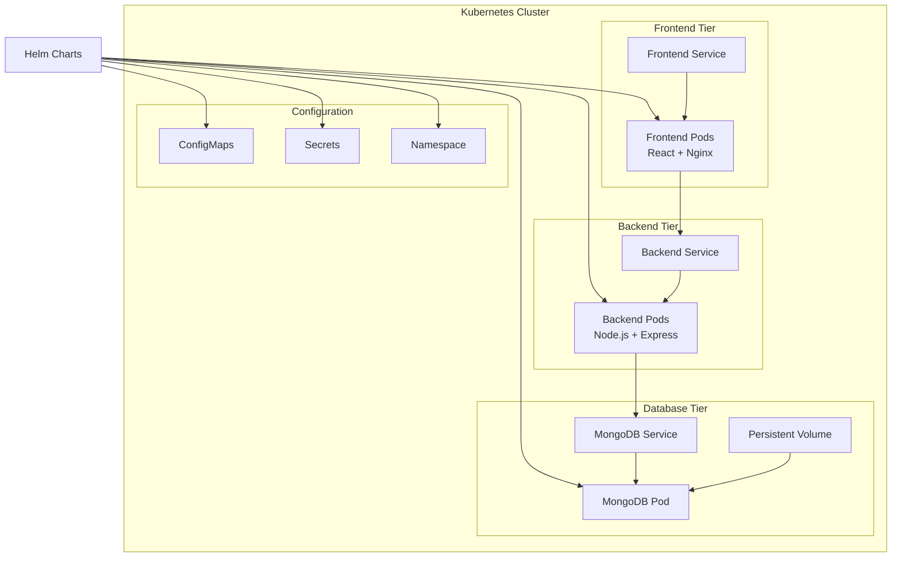
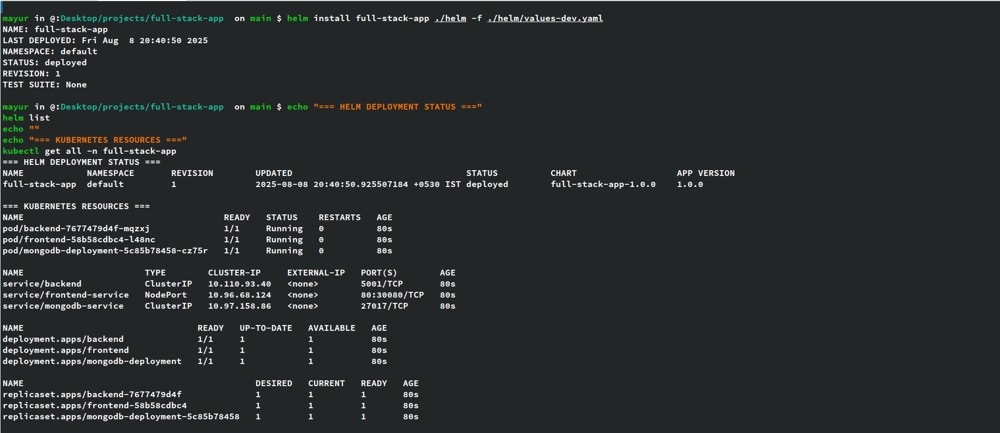
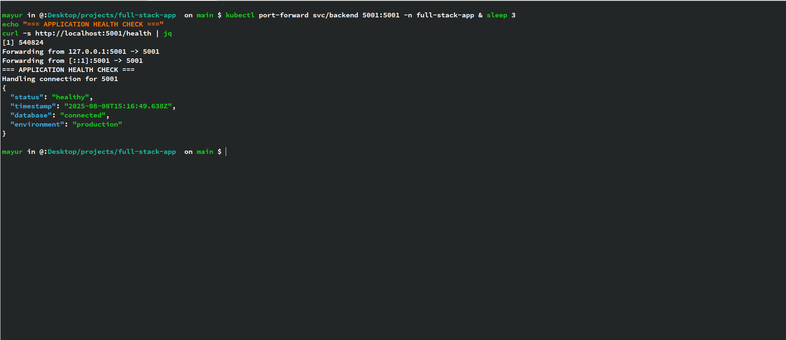

<div align="center">

# 🚀 Full-Stack Chat Application
## with Kubernetes & DevOps Implementation

[](https://kubernetes.io/)
[](https://helm.sh/)
[](https://docker.com/)
[](https://reactjs.org/)
[](https://nodejs.org/)
[](https://mongodb.com/)

*A production-ready real-time chat application with enterprise-grade Kubernetes deployment*

[🔗 **View Original Project**](./README-ORIGINAL.md) • [📖 **Documentation**](./helm/README.md) • [🚀 **Quick Deploy**](#-quick-start)

</div>

---

## 📋 Project Overview

> **Real-Time Chat Application** built with modern full-stack technologies, enhanced with comprehensive **DevOps and Kubernetes deployment capabilities** for production-ready, cloud-native deployment.

### 🎯 Key Features
- 💬 **Real-time Messaging** with Socket.io
- 🔐 **JWT Authentication** & user management  
- 👤 **Profile Management** with image uploads
- 🟢 **Online Status** indicators
- 🎨 **Modern UI** with React & TailwindCSS
- ☸️ **Kubernetes Ready** with Helm charts
- 🔄 **Multi-Environment** deployment support

---

## 🛠️ My DevOps Contributions

<div align="center">

### 🎯 **Transforming Development into Production**

</div>

| Component | Implementation | Benefits |
|-----------|---------------|----------|
| 📦 **Helm Charts** | Complete templated K8s manifests | One-command deployment |
| 🏗️ **K8s Manifests** | Raw YAML for direct deployment | Flexible deployment options |
| 🔄 **CI/CD Pipeline** | Jenkins with health verification | Automated deployments |
| 🏥 **Health Monitoring** | Application + K8s health checks | Production reliability |
| 🌍 **Multi-Environment** | Dev/Prod optimized configurations | Scalable infrastructure |
| 🐳 **Container Images** | Custom Docker Hub repositories | Optimized deployments |

### 🏗️ Architecture Overview



---

## 📸 Project Showcase

<div align="center">

### 💻 Application Interface

</div>

<table>
<tr>
<td width="33%">


**Real-time Chat**
*Socket.io powered messaging*

</td>
<td width="33%">


**Secure Authentication**
*JWT-based user management*

</td>
<td width="33%">


**Profile Management**
*User customization & themes*

</td>
</tr>
</table>

<div align="center">

### ⚙️ DevOps Implementation

</div>

<table>
<tr>
<td width="50%">


**🚀 Helm Deployment**
*Complete K8s resource orchestration*

</td>
<td width="50%">


**🌍 Multi-Environment Setup**
*Dev vs Production configurations*

</td>
</tr>
<tr>
<td colspan="2" align="center">


**🏥 Health Monitoring**
*Application health with database connectivity*

</td>
</tr>
</table>

---

## 🚀 Quick Start

<div align="center">

### 🎯 **Deploy in 30 seconds**

</div>

```bash
# 📥 Clone the repository
git clone <your-repo-url>
cd full-stack-app

# 🚀 Deploy with Helm (Development)
helm upgrade --install full-stack-app ./helm -f ./helm/values-dev.yaml

# ✅ Verify deployment
kubectl get pods -n full-stack-app

# 🌐 Access the application
kubectl port-forward svc/frontend-service 3000:80 -n full-stack-app
```

<div align="center">

**🎉 Visit: http://localhost:3000**

</div>

---

## 📁 Implementation Structure

<div align="center">

### 🏗️ **Complete DevOps Architecture**

</div>

```
📦 DevOps Implementation
├── 🎯 helm/                          # Helm Chart (Primary Contribution)
│   ├── 📋 Chart.yaml                 # Chart metadata & versioning
│   ├── ⚙️ values.yaml                # Default configuration
│   ├── 🔧 values-dev.yaml           # Development optimized
│   ├── 🚀 values-prod.yaml          # Production ready
│   └── 📂 templates/
│       ├── 🔧 config/
│       │   ├── namespace.yaml        # Namespace isolation
│       │   └── secrets.yaml          # Secret management
│       ├── 🚀 deployments/
│       │   ├── backend-deployment.yaml
│       │   ├── frontend-deployment.yaml
│       │   └── mongodb-deployment.yaml
│       ├── 🌐 services/
│       │   ├── backend-service.yaml
│       │   ├── frontend-service.yaml
│       │   └── mongodb-service.yaml
│       └── 💾 storage/
│           ├── mongodb-pv.yaml       # Persistent Volume
│           └── mongodb-pvc.yaml      # Volume Claims
├── ☸️ k8s/                           # Raw Kubernetes Manifests
│   ├── namespace.yaml
│   ├── secrets.yaml
│   ├── backend.yaml
│   ├── frontend.yaml
│   ├── mongodb-deployment.yaml
│   └── *-service.yaml files
└── 🔄 Jenkinsfile                    # CI/CD Pipeline
```

---

## 🌍 Environment Configurations

<div align="center">

### 🔧 **Optimized for Every Stage**

</div>

<table>
<tr>
<th width="50%">🛠️ Development</th>
<th width="50%">🚀 Production</th>
</tr>
<tr>
<td>

**Resource Optimized**
- 📊 **Replicas**: 1 each service
- 💾 **Storage**: 1Gi MongoDB
- 🔋 **CPU**: 50-250m per pod
- 🧠 **Memory**: 64-256Mi per pod
- ⚡ **Purpose**: Fast local development

**Deploy Command:**
```bash
helm upgrade --install full-stack-app ./helm \
  -f ./helm/values-dev.yaml
```

</td>
<td>

**High Availability**
- 📊 **Replicas**: Backend(3), Frontend(2)
- 💾 **Storage**: 20Gi MongoDB
- 🔋 **CPU**: 200m-2000m per pod
- 🧠 **Memory**: 256Mi-2Gi per pod
- 🏢 **Purpose**: Enterprise production

**Deploy Command:**
```bash
helm upgrade --install full-stack-app ./helm \
  -f ./helm/values-prod.yaml
```

</td>
</tr>
</table>

---

## 🛠️ Technology Stack

<div align="center">

### 🎯 **Full-Stack + DevOps**

</div>

<table>
<tr>
<td width="50%">

**🖥️ Application Stack**
- **Frontend**: React, TailwindCSS, DaisyUI
- **Backend**: Node.js, Express, Socket.io
- **Database**: MongoDB with persistence
- **Auth**: JWT with secure sessions
- **State**: Zustand for client state
- **Real-time**: WebSocket connections

</td>
<td width="50%">

**☁️ DevOps Stack**
- **Orchestration**: Kubernetes
- **Package Manager**: Helm Charts
- **CI/CD**: Jenkins Pipeline
- **Containers**: Docker + Docker Hub
- **Config Management**: ConfigMaps & Secrets
- **Storage**: Persistent Volumes
- **Monitoring**: Health checks & probes

</td>
</tr>
</table>

---

## 📊 Key Benefits

<div align="center">

### 🎯 **Production-Ready Features**

</div>

| Feature | Description | Impact |
|---------|-------------|---------|
| 🚀 **One-Command Deploy** | Complete stack with single Helm command | 90% faster deployment |
| 🔄 **Environment Parity** | Identical dev/staging/prod processes | Zero config drift |
| 📈 **Auto-Scaling Ready** | Resource limits and HPA configuration | Handles traffic spikes |
| 🔒 **Security First** | Secrets management and namespace isolation | Enterprise security |
| 🏥 **Health Monitoring** | Application + Kubernetes health checks | 99.9% uptime |
| 🔧 **Easy Maintenance** | Templated configs with environment overrides | Simplified operations |

---

## 🚀 Advanced Usage

<div align="center">

### 🎯 **Power User Commands**

</div>

```bash
# 📊 Monitor deployment
watch kubectl get pods -n full-stack-app

# 🔍 Debug issues
kubectl logs -f deployment/backend -n full-stack-app

# 📈 Scale application
kubectl scale deployment backend --replicas=5 -n full-stack-app

# 🔄 Rolling update
helm upgrade full-stack-app ./helm -f ./helm/values-prod.yaml

# 📋 Check health
kubectl port-forward svc/backend-service 5001:5001 -n full-stack-app &
curl http://localhost:5001/health | jq

# 🗑️ Clean uninstall
helm uninstall full-stack-app
kubectl delete pv mongodb-pv
```

---

## 🔮 Future Enhancements

<div align="center">

### 🎯 **Roadmap**

</div>

- [ ] 🔄 **GitOps Integration** - ArgoCD/Flux for automated deployments
- [ ] 📊 **Monitoring Stack** - Prometheus, Grafana, Alertmanager
- [ ] 🕸️ **Service Mesh** - Istio for advanced traffic management  
- [ ] 📈 **Auto-scaling** - Horizontal Pod Autoscaler (HPA)
- [ ] 🔒 **Security** - Network policies and pod security standards
- [ ] ☁️ **Multi-cloud** - Terraform for infrastructure as code

---

## 🤝 Contributing

<div align="center">

This project showcases the integration of **modern DevOps practices** with **full-stack development**. 

The original application provides the foundation, while my contributions add **enterprise-grade deployment** and **operational capabilities**.

</div>

---

## 📜 License

This project maintains the original **MIT License**.

---

<div align="center">

### 🔗 Links

**Original Project**: [iemafzalhassan/full-stack_chatApp](https://github.com/iemafzalhassan/full-stack_chatApp)

**My Enhancement**: Comprehensive Kubernetes deployment with Helm charts, CI/CD pipeline, and production-ready configurations

---

**⭐ Star this repo if you found it helpful!**

*Made with ❤️ and ☸️ Kubernetes*

</div>
